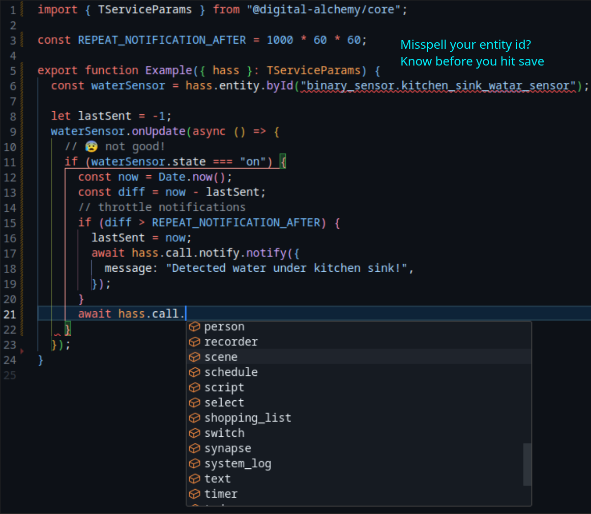
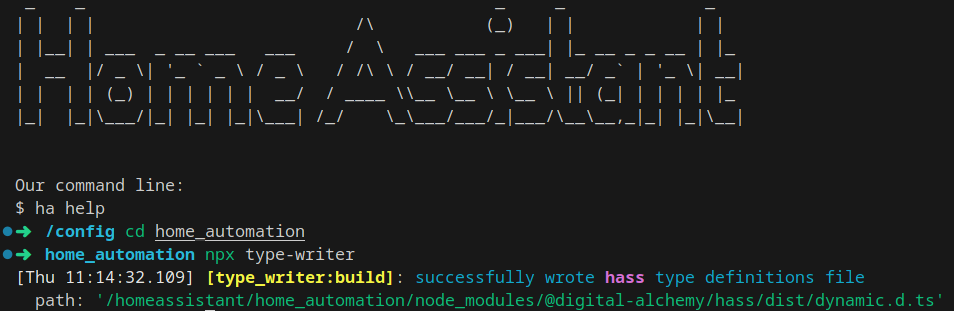

Welcome to `@digital-alchemy/type-writer`!

This application acts a support application for [@digital-alchemy/hass](https://github.com/Digital-Alchemy-TS/hass), providing type definitions to assist during development

- [Project docs](https://docs.digital-alchemy.app)
- [Discord](https://discord.gg/JkZ35Gv97Y)



## 🚀 Usage

```bash
# install to devDependencies
npm i --save-dev @digital-alchemy/type-writer
# run
npx type-writer
```


### Watch mode

`WATCH_MODE=true npx type-writer`

In watch mode,`type-writer` will remain running and output new types every time something is changed within Home Assistant. You can also add this in the configuration file mentioned below

## ⚙️ Configuration

If you are running your code within a Home Assistant addon environment, `type-writer` will automatically connect to your install. No configuration needed!

For setups outside an addon environment, a configuration file is needed. Create one of the following:

- `.type_writer`: add to project root
- `~/.config/type_writer`: add to user configs

**Contents:**

```ini
[hass]
  BASE_URL=http://localhost:8123
  TOKEN=... # YOUR LONG LIVED ACCESS TOKEN
```
